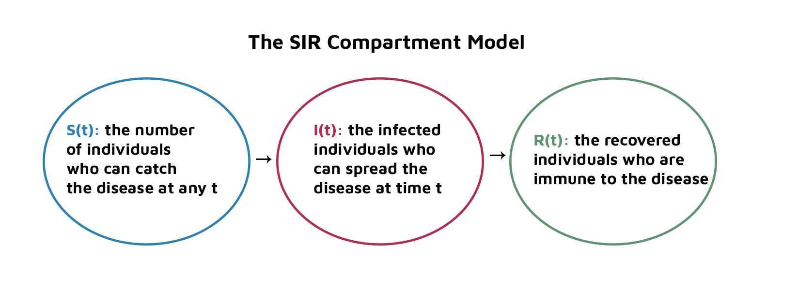
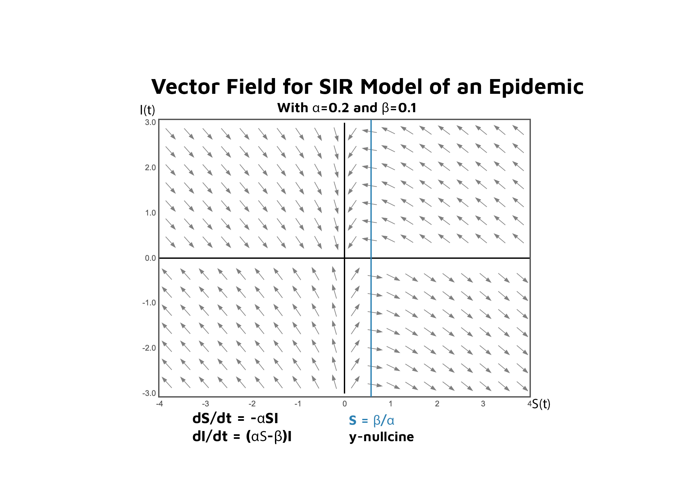

# About
This project implements the SIR model (susceptible-infected-recovered (SIR) model) to study the spread of infectious diseases. Using two papers presented in the **Docs** directory, we represent the SIR model for the case of EVD in 
Liberia in 2014 and the case of COVID-19 in South Korea in 2020. 

**I(t)** the infected individuals who can spread the disease
**S(t)** the number of individuals who can catch the disease @ any t 
**R(t)** the individuals who have recovered from disease & attained immunity, including those who passed away from the disease 

 

 

`main`
The main program which implements the SIR model following the Kermack and McKendrick 1927 Epidemic Model
as outlined in 4th Edition of Differential Equations (Blanchard, Devaney, Hall 2012.) Graphs I(t), S(t), and R(t)
using Euler's Method for a system of differential equations. Allows for user inputs to β, α. 

`case_examples`
Presents two implementations of the SIR model according to cited papers: one studies the spread of EVD (Ebola) in Liberia in 2014. The other one investigates the spread of COVID-19 in South Korea. The plots are made according to values of α and β as determined and outlined in the respective studies. 

`param_ratio`
Rewrites the differential equation system as I(S) and graphs I(S) = 0 as a function of ρ where  ρ=β/α. The solutions for which I(S) = 0 indicates the fraction of the population that avoids getting infected altogether 

`vaccinated_SIR`
Presents an altered model that incorporates the assumption that a percentage of the population is vaccinated, thus reducing S(t), that is, the proportion of the population that is susceptible at time *t*. Given α, β as user inputs, 
the program informs the user of the percentage of the population that would need to be vaccinated to prevent the epidemic. Displays the graph with the SIR model incorporating the vaccinated percentage of the population. 

`works_cited`
As described, a citation of the textbook, the various papers referenced, and a couple of websites that proved helpful. Also here is a (very) brief evaluation of the limitations of the model and suggested expansions. 

# Works Cited 
Study used for the case example of Coronavirus in South Korea: 
https://www.medrxiv.org/content/10.1101/2020.04.13.20063412v1

Analysis of COVID-19 spread in South Korea using the SIR model with time-dependent parameters and deep learning
Hyeontae Jo, Hwijae Son, Se Young Jung, Hyung Ju Hwang
medRxiv 2020.04.13.20063412; doi: https://doi.org/10.1101/2020.04.13.20063412