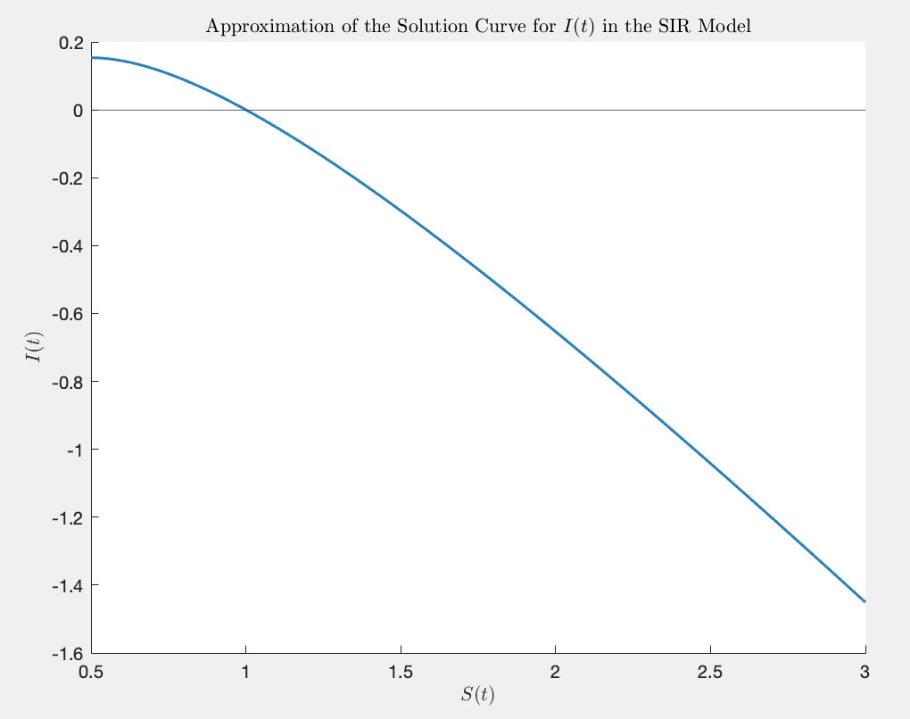
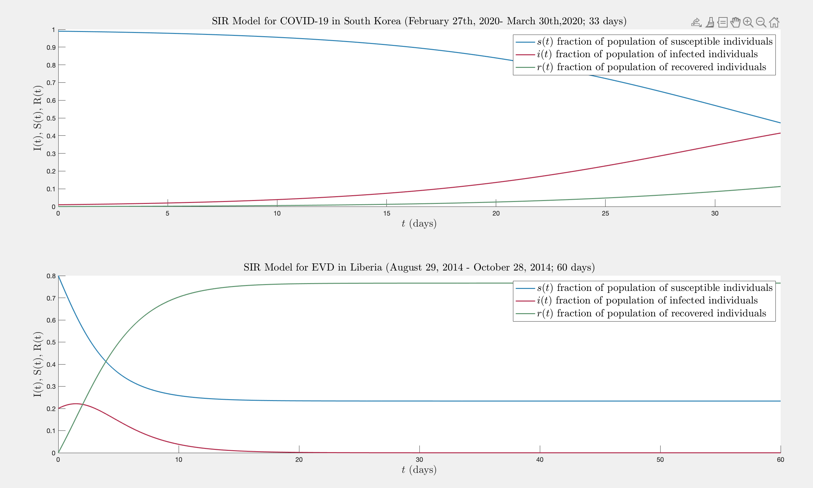
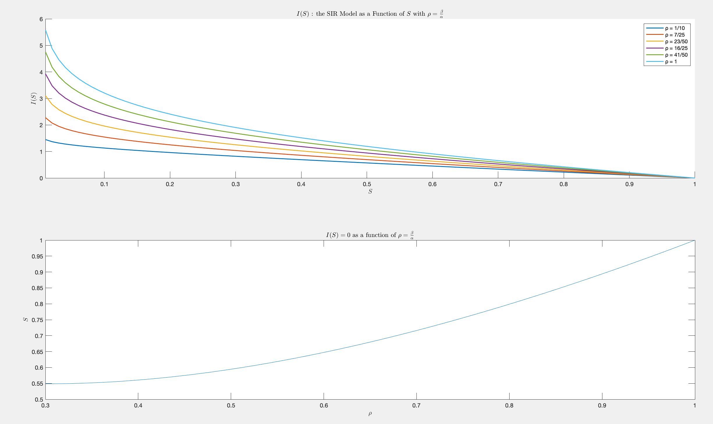
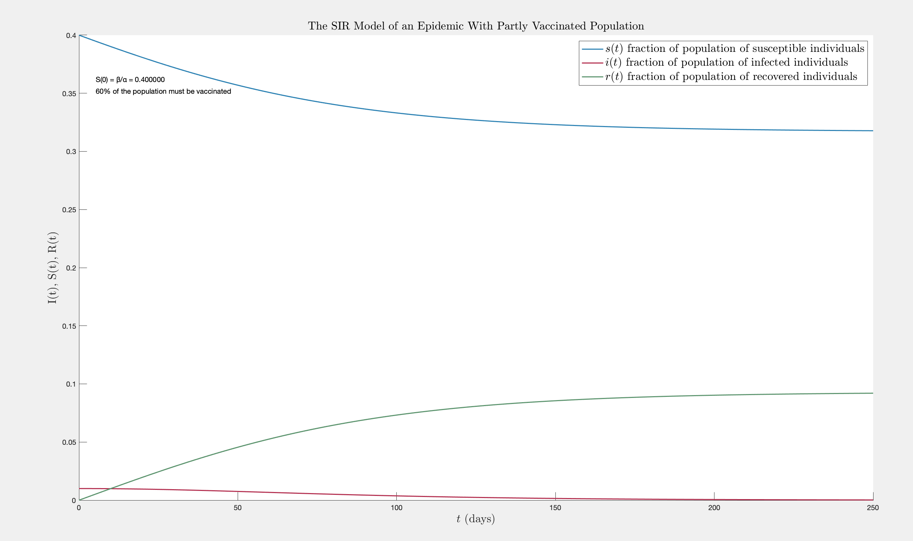

# Programs
`weighted_least_squares`
plots height as a function of time & uses weighted
least squares equations to fit a line 

`feigenbaum`
quantifies the approach of chaos via period doubling with the standard logistic map 

`logistic_map`
calculates sequence for given parameter of <i>r</i>
& plots sequence as a function of the parameter 

`logistic_map_redux`
logistic map with plotted sequences of <i>N</i> vs <i>X_n</i> for different values of <i>r</i>  

`lyapunov`
calculates and plots the lyapunov exponent which characterizes 
sensitivity to initial conditions  
(the rate of separation of infinitesimally close trajectories)  

`witch_of_agnesi`
plots the famous curve of Maria Agnesi  

`linear_least_squares`
plots a polynomial fitting for y to x and x to y  

`fibonacci`
computes the fibonacci sequence up to n terms & plots convergence to the golden ratio   

`pendulum`
plots the standard solution of a pendulum starting from rest  

`max_finder`
returns the maximum value of a matrix and its index  

`bisection_method`
calculates the cube root of 169 using the bisection method 

`secant method`
calculates the cube root of 169 using the secant method

`newton_raphson_legendre`
finds the smallest positive root of the ninth legendre polynomial using the Newton-Raphson technique

`finite_square_well`
plots the lowest solutions to the square well

`finite_square_well_energies`
finds the first allowable energies of a finite square well by calculating the 
intersections of the graphs  

  

`function_plot`
simply plots a standard function

`runge_phenomenon`
plots the oscillation at edges of intervals due to high degree Lagrangian polynomials (runge's phenomenon)over equispaced interpolation points and plots interpolating polynomials of the 5th & 9th order

`root_of_bessel`
plots and finds the root of the bessel function

`interpolations	`
finds linear, quadratic, and cubic interpolations of the airy pattern 

`airy pattern`
plots the airy pattern continuously and for a discrete set of values

 

`derivative_approx_diff	`
plots the forward, backward, and central approximations of the derivative of a function

 

`fresnel_integrals`
numerically integrates the Fresnel integrals to plot diffraction pattern of knife edge

 

`integration_i`
integrates sin function using trapezoid, Simpson's, and Simpson's 3/8 rule

 

 

 

`large_amp_pendulum`
plots the period of the large amplitude pendulum as a function of the amplitude

 
 

`2D_random_walkers`
visualizes 1,000 2D random walkers starting at same origin at same time
 

`integration_1`
integrates a two dimensional integral with the trapezoidal rule 

`integration_2`
integrates a multi-dimensional integral

`linear_congruential_rand`
generates a series of random numbers starting from uniform using pseudorandom generator between 0 and 1 and compares with MATLAB rand() via histograms
 

# Drake Equation 
MATLAB program allows for users inputs to the factors of the Drake Equation, which attempts to calculate
the number of civilizations on life-bearing planets in the galaxy that can emit detectable signals. 

 

`main`
allows users to input the factors for the Drake Equation and plots the number of civilizations as a function of varying L, which represents how long a civilization can emit signals (i.e. the life span of the civilization) 

`examples`
gives four examples of variable inputs to the Drake Equation and displays the resulting graph with upper and lower bound indicators
 

`fixed_L`
computes the number of civilizations *N* with the Drake Equation with user inputs for all factors except <i>L</i>, which is a randomly generated number within a pre-prescribed range 

# The SIR Model
Project implements the **SIR model** (susceptible-infected-recovered (SIR) model) to study the spread of infectious diseases. Using two papers presented in the Docs directory, the SIR model is represented for the case of EVD in Liberia in 2014 and the case of COVID-19 in South Korea in 2020.

**I(t)** the infected individuals who can spread the disease  
**S(t)** the number of individuals who can catch the disease @ any t  
**R(t)** the individuals who have recovered from disease & attained immunity, including those who passed away from the disease 

 

 

`main`
The main program which implements the SIR model following the Kermack and McKendrick 1927 Epidemic Model
as outlined in 4th Edition of Differential Equations (Blanchard, Devaney, Hall 2012.) Graphs I(t), S(t), and R(t)
using Euler's Method for a system of differential equations. Allows for user inputs to β, α and also includes an approximation to the solution curve for I(t) in the SIR model. 

 

 

`case_examples`
Presents two implementations of the SIR model according to cited papers: one studies the spread of EVD (Ebola) in Liberia in 2014. The other one investigates the spread of COVID-19 in South Korea. The plots are made according to values of α and β as determined and outlined in the respective studies. 

  

`param_ratio`
Rewrites the differential equation system as I(S) and graphs I(S) = 0 as a function of ρ where  ρ=β/α. The solutions for which I(S) = 0 indicates the fraction of the population that avoids getting infected altogether 

  

`vaccinated_SIR`
Presents an altered model that incorporates the assumption that a percentage of the population is vaccinated, thus reducing S(t), that is, the proportion of the population that is susceptible at time *t*. Given α, β as user inputs, 
the program informs the user of the percentage of the population that would need to be vaccinated to prevent the epidemic. Displays the graph with the SIR model incorporating the vaccinated percentage of the population. 

  

`works_cited`
As described, a citation of the textbook, the various papers referenced, a couple of websites that proved helpful, and a (very) brief evaluation of the limitations of the model and suggested expansions. 

